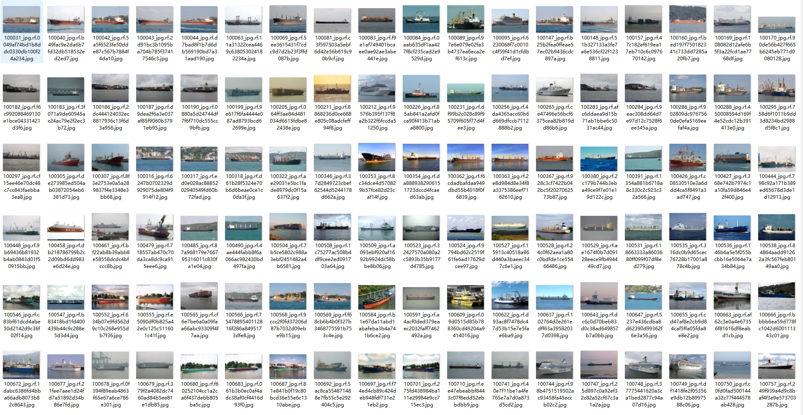
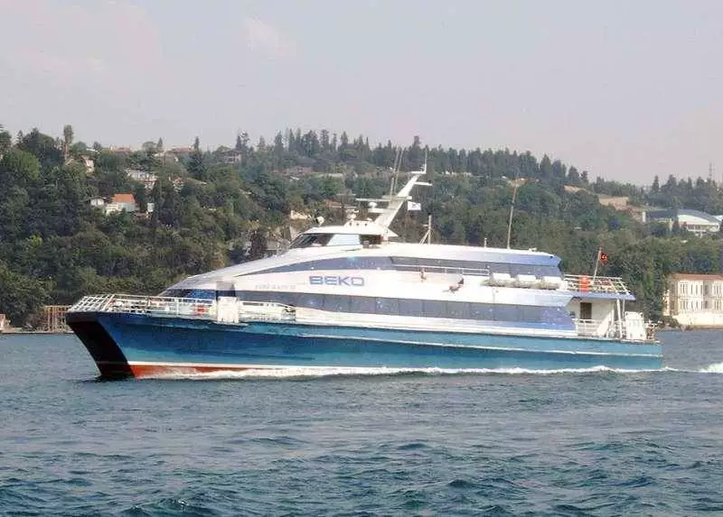
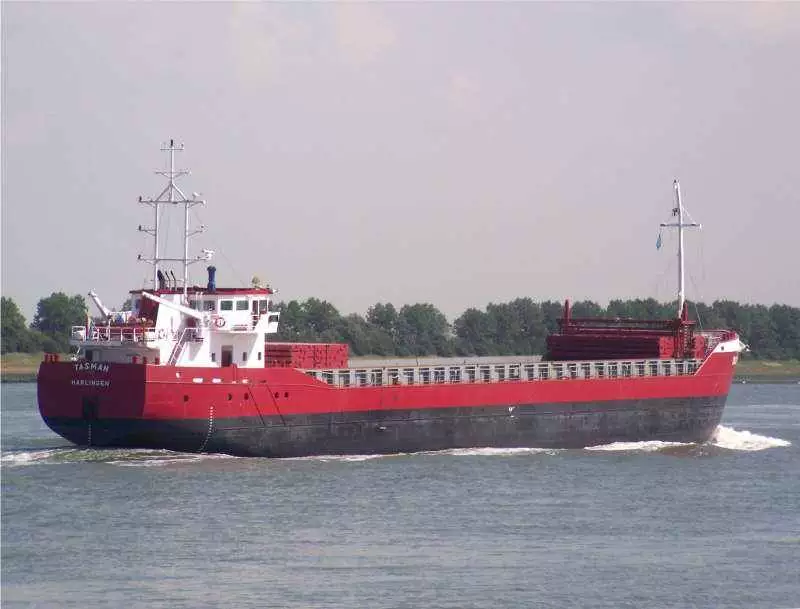
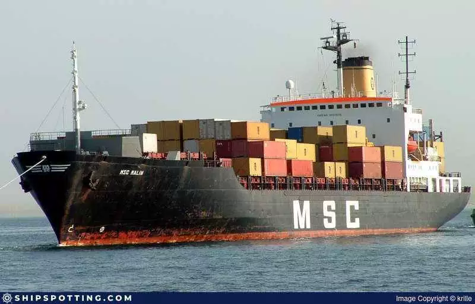
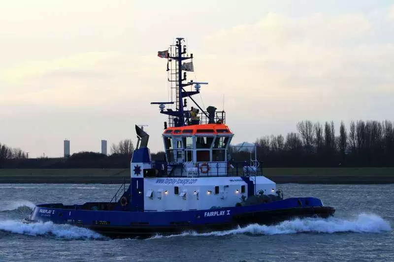

## Body

Yangtze River Delta, China

The dataset consists of over 5000 images, each labeled with a specific category. It is divided into ten categories: 'BULK CARRIER', 'CONTAINER SHIP', 'GENERAL CARGO', 'OIL PRODUCTS TANKER', 'PASSENGERS SHIP', 'TANKER', 'TRAWLER', 'TUG', 'VEHICLES CARRIER', and 'YACHT'.

The dataset covers a wide range of ships, including bulk carriers, container ships, general cargo ships, oil products tankers, passenger ships, oil tankers, trawlers, tugs, vehicles carriers, and yachts.

Electronic virtual products sold are non-refundable.

## Images

Here is a pay link on Stripe ( https://buy.stripe.com/3cs8yP7sY87d0vu9AB ). Please contact me lonlonago@foxmail.com after funding $89, and I will send you a complete data files , thank you!

